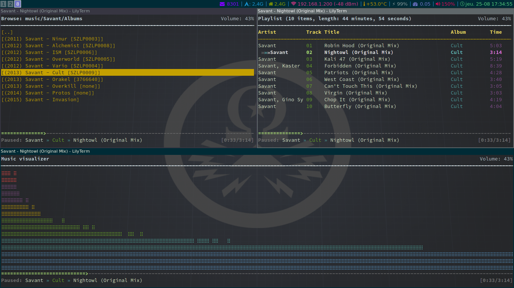

# Dotfiles

This repository contains some of the dotfiles I use.
Most of them have been scavenged in various forums, blog post or github dotfiles repository like this one.

# Software Installed

## Official
* OS: [**Archlinux**](https://www.archlinux.org/)
* Session Manager: [**slim**](https://wiki.archlinux.org/index.php/SLiM)
* Tiling Window Manager: [**i3-gaps**](https://www.archlinux.org/packages/community/x86_64/i3-gaps/) a fork from [**i3-wm**](https://wiki.archlinux.org/index.php/i3) 
* Terminal: [**termite**](https://github.com/thestinger/termite)
* Shell: [**zsh**](https://wiki.archlinux.org/index.php/zsh)
* Editor: [**vim**](https://wiki.archlinux.org/index.php/vim)
* Music: [**mpd**](https://wiki.archlinux.org/index.php/Music_Player_Daemon) + [**ncmpcpp**](https://wiki.archlinux.org/index.php/Ncmpcpp)
* File Manager: [**ranger**](https://wiki.archlinux.org/index.php/ranger), [**pcmanfm**](https://wiki.archlinux.org/index.php/PCManFM)
* Background: [**feh**](https://wiki.archlinux.org/index.php/feh)
* Misc: [**lm_sensors**](https://wiki.archlinux.org/index.php/lm_sensors), [**acpi**](https://wiki.archlinux.org/index.php?title=ACPI_modules&redirect=no)

## AUR
* Status Bar: [**polybar**](https://aur.archlinux.org/packages/polybar/)
* Lock Screen: [**i3lock-fancy-git**](https://aur.archlinux.org/packages/i3lock-fancy-git/)
* Quick launcher: [**dmenu2**](https://aur.archlinux.org/packages/dmenu2/) 
* Zsh Improvement: [**zsh-zim-git**](https://aur.archlinux.org/packages/zsh-zim-git/)
* Fonts: [**powerline-fonts-git**](https://aur.archlinux.org/packages/powerline-fonts-git/)

## GTK Related
* GTK Configuration Tool: [**lxappearance**](https://www.archlinux.org/packages/community/x86_64/lxappearance/)
* GTK-Theme: [**Adapta**](https://www.archlinux.org/packages/community/any/adapta-gtk-theme/)
* GTK Icon: [**arc-icon-theme**](https://github.com/horst3180/arc-icon-theme)

## Misc
* Background Image: [here](img/clean.png) (source: [**Bridges Zero Punctuation**](https://onlyhdwallpapers.com/Bridges_Zero_Punctuation_yahtzee-1CEV))

# Screenshots

## Old configuration

